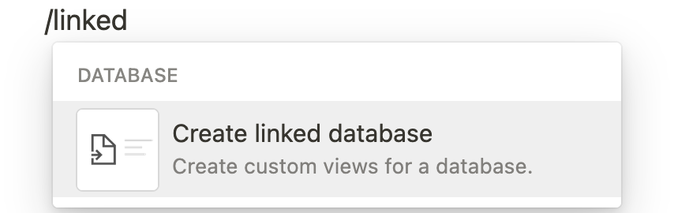
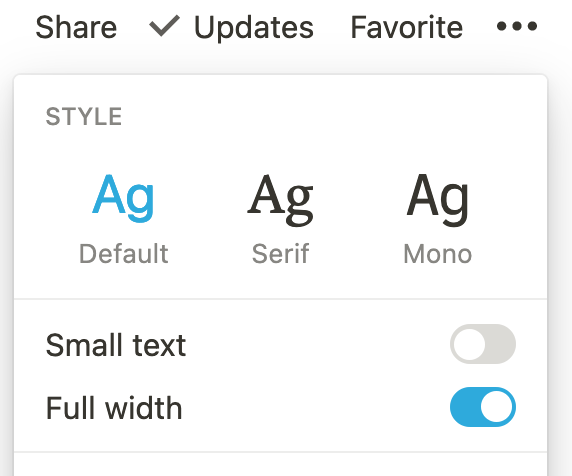
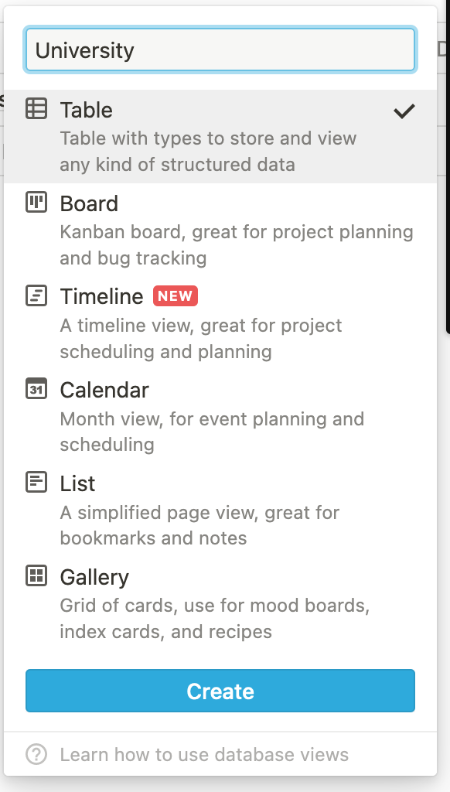
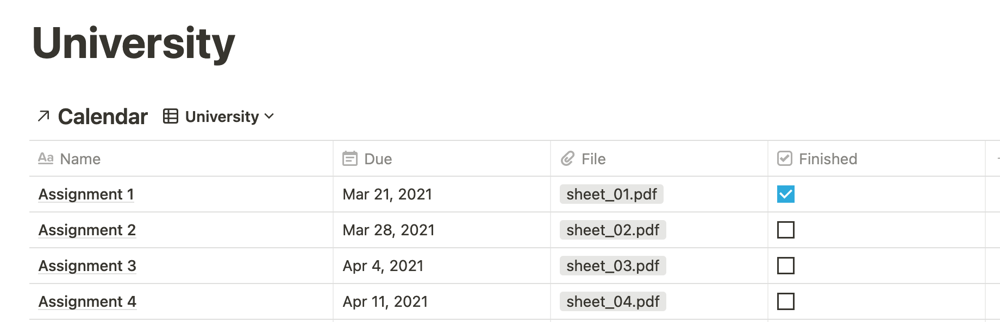
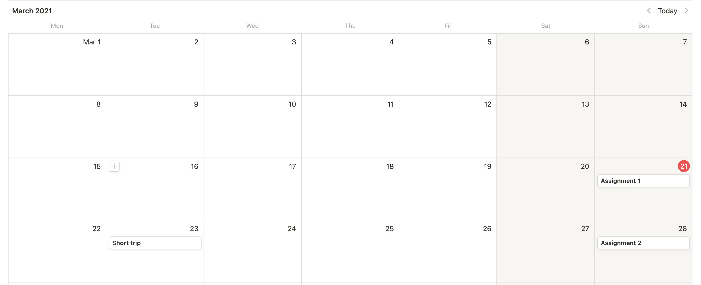

[Notion](https://www.notion.so/) is an amazing tool! I use it to organize almost all aspects of my life.
It took me quite a while to find the perfect workflow for me, that's why I want to show one of the tricks that helped me get my Notion game to the next level!
# Linked Databases

One thing that always irked me about Notion was that since I use different workspaces for different areas of my life (e.g work, studies, travel, etc.), 
I was forced to use different calendars aswell. This was particularly annoying when I for example wanted to keep track of different due dates of different classes in university.
 I had to use one calendar for each class and check each calendar frequently.
This got quite annoying quite fast and I switched promptly back to google calendar for this kind of task.
This was of course until I learned about the glorious linked databases! They solved my problem completely and I was able to share one calendar between multible pages!
So how do linked databases work?
Essentially its just one single database that can be used in different workspaces where changes in one workspace affect the other one.
Creating a linked database is quite easy, just go to the page where you want to create one and type the command just like in the picture below.
There you can choose which database you want to link to.

Of course we have to have an original database first before we can link to it.
When creating a linked database, you will notice that it is not formatted properly and does not use the full width of the page.
In order to fix this you have to go to the settings on the top right and enable the option 'full-width'.

## A simple example 

So what now? We just created a linked database but how can we use this for our benefit? 
I will explain it in a simple example so you can immediately see how handy they are!

Let's say we have two kinds of information we want to track in a database assignments for university and their respective due date and additionally we want to keep track of our travel plans and their dates.
We want both in one singular database. Let's see how to do it!

First we create a new workspace with a single database inside. This will be our main database that we link to from any other workplace.
We choose the calendar view since we want to see all dates from any workspace we use it in.

The next step is to create our first linked database. Let's begin with a one for university assignments.
After creating it we need to add different fields to track our assignments. In this example we have one field for the due date, one field for the pdf and a checkbox to check whether we are done with the assignment.
The trick now is to add a new field, we call it "Tag", as a "Select" property type. 
We use this field in order to filter our different linked databases. All of our entries in our university page will have a Tag named "University".
After doing all this, there is one final step: We must create a new View and add a filter to this view in order to only show entries with the proper tag.
Creating a new view is quite simple as you can see on the screenshot below. Just navigate to the view selector and then click on "Add a view".
In our case we create a view with the name "University". 

In order to add a filter to this view we navigate to the top right of the database and click on "Filter". Here we set the filter option to "Tag is University" as seen in the screenshot.

Dont forget to again set the page to full width.
 
 Here is how the final page could look like. Note that we can just hide the "Tag" field, since it doesn't give us any important information.

## Adding a second linked database
Next we want to keep track of our travel plans. So let's do this!
We again create a new page create a new linked database to our calendar.
We continue doing the same steps as before! Instead of creating a Tag called "University" we create one called "Travel".
Additionally, our travel plans need new fields. But that's no problem. If you create a new linked database you will see all the fields from the main database, some of which you dont need.
We simply hide those fields we don't need and just create new ones.

## The final result

Finally we are finished! If we go back to our original calendar page we can now see ALL the events from all databases that link to them!
How neat is that?!

I hope you can use this trick to great use just like I do every day :)